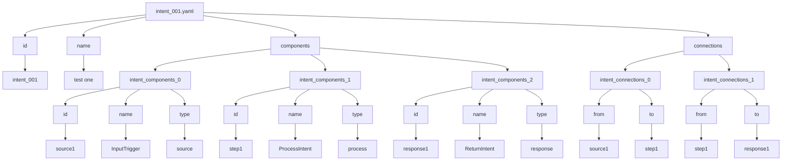

```mermaid
graph TD
    intent["intent_001.yaml"]
    intent --> intent_id
    intent_id["id"]
    intent_id --> intent_id_val
    intent_id_val["intent_001"]
    intent --> intent_name
    intent_name["name"]
    intent_name --> intent_name_val
    intent_name_val["test one"]
    intent --> intent_components
    intent_components["components"]
    intent_components --> intent_components_0
    intent_components_0 --> intent_components_0_id
    intent_components_0_id["id"]
    intent_components_0_id --> intent_components_0_id_val
    intent_components_0_id_val["source1"]
    intent_components_0 --> intent_components_0_name
    intent_components_0_name["name"]
    intent_components_0_name --> intent_components_0_name_val
    intent_components_0_name_val["InputTrigger"]
    intent_components_0 --> intent_components_0_type
    intent_components_0_type["type"]
    intent_components_0_type --> intent_components_0_type_val
    intent_components_0_type_val["source"]
    intent_components --> intent_components_1
    intent_components_1 --> intent_components_1_id
    intent_components_1_id["id"]
    intent_components_1_id --> intent_components_1_id_val
    intent_components_1_id_val["step1"]
    intent_components_1 --> intent_components_1_name
    intent_components_1_name["name"]
    intent_components_1_name --> intent_components_1_name_val
    intent_components_1_name_val["ProcessIntent"]
    intent_components_1 --> intent_components_1_type
    intent_components_1_type["type"]
    intent_components_1_type --> intent_components_1_type_val
    intent_components_1_type_val["process"]
    intent_components --> intent_components_2
    intent_components_2 --> intent_components_2_id
    intent_components_2_id["id"]
    intent_components_2_id --> intent_components_2_id_val
    intent_components_2_id_val["response1"]
    intent_components_2 --> intent_components_2_name
    intent_components_2_name["name"]
    intent_components_2_name --> intent_components_2_name_val
    intent_components_2_name_val["ReturnIntent"]
    intent_components_2 --> intent_components_2_type
    intent_components_2_type["type"]
    intent_components_2_type --> intent_components_2_type_val
    intent_components_2_type_val["response"]
    intent --> intent_connections
    intent_connections["connections"]
    intent_connections --> intent_connections_0
    intent_connections_0 --> intent_connections_0_from
    intent_connections_0_from["from"]
    intent_connections_0_from --> intent_connections_0_from_val
    intent_connections_0_from_val["source1"]
    intent_connections_0 --> intent_connections_0_to
    intent_connections_0_to["to"]
    intent_connections_0_to --> intent_connections_0_to_val
    intent_connections_0_to_val["step1"]
    intent_connections --> intent_connections_1
    intent_connections_1 --> intent_connections_1_from
    intent_connections_1_from["from"]
    intent_connections_1_from --> intent_connections_1_from_val
    intent_connections_1_from_val["step1"]
    intent_connections_1 --> intent_connections_1_to
    intent_connections_1_to["to"]
    intent_connections_1_to --> intent_connections_1_to_val
    intent_connections_1_to_val["response1"]
```