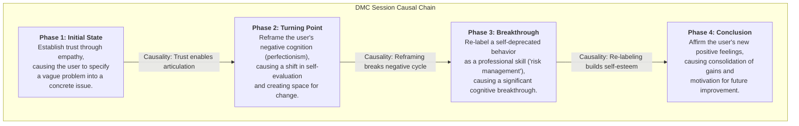

```mermaid
flowchart TD
    subgraph "DMC Session Causal Chain"
        A["<strong>Phase 1: Initial State</strong><br>Establish trust through empathy,<br>causing the user to specify<br>a vague problem into a concrete issue."]
        -->|Causality: Trust enables articulation| B
        
        B["<strong>Phase 2: Turning Point</strong><br>Reframe the user's negative cognition (perfectionism),<br>causing a shift in self-evaluation<br>and creating space for change."]
        -->|Causality: Reframing breaks negative cycle| C
        
        C["<strong>Phase 3: Breakthrough</strong><br>Re-label a self-deprecated behavior<br>as a professional skill ('risk management'),<br>causing a significant cognitive breakthrough."]
        -->|Causality: Re-labeling builds self-esteem| D
        
        D["<strong>Phase 4: Conclusion</strong><br>Affirm the user's new positive feelings,<br>causing consolidation of gains and<br>motivation for future improvement."]
    end
```