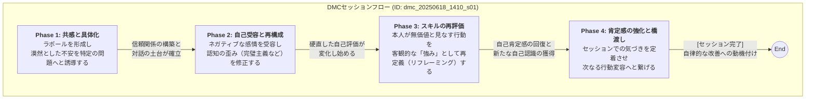

```mermaid
flowchart TD
    subgraph "DMCセッションフロー (ID: dmc_20250618_1410_s01)"
        A["<strong>Phase 1: 共感と具体化</strong><br>ラポールを形成し<br>漠然とした不安を特定の問題へと誘導する"]
        -->|"信頼関係の構築と<br>対話の土台が確立"| B

        B["<strong>Phase 2: 自己受容と再構成</strong><br>ネガティブな感情を受容し<br>認知の歪み（完璧主義など）を修正する"]
        -->|"硬直した自己評価が<br>変化し始める"| C

        C["<strong>Phase 3: スキルの再評価</strong><br>本人が無価値と見なす行動を<br>客観的な「強み」として再定義（リフレーミング）する"]
        -->|"自己肯定感の回復と<br>新たな自己認識の獲得"| D

        D["<strong>Phase 4: 肯定感の強化と橋渡し</strong><br>セッションでの気づきを定着させ<br>次なる行動変容へと繋げる"]
        -->|"[セッション完了]<br>自律的な改善への動機付け"| E((End))
    end
```