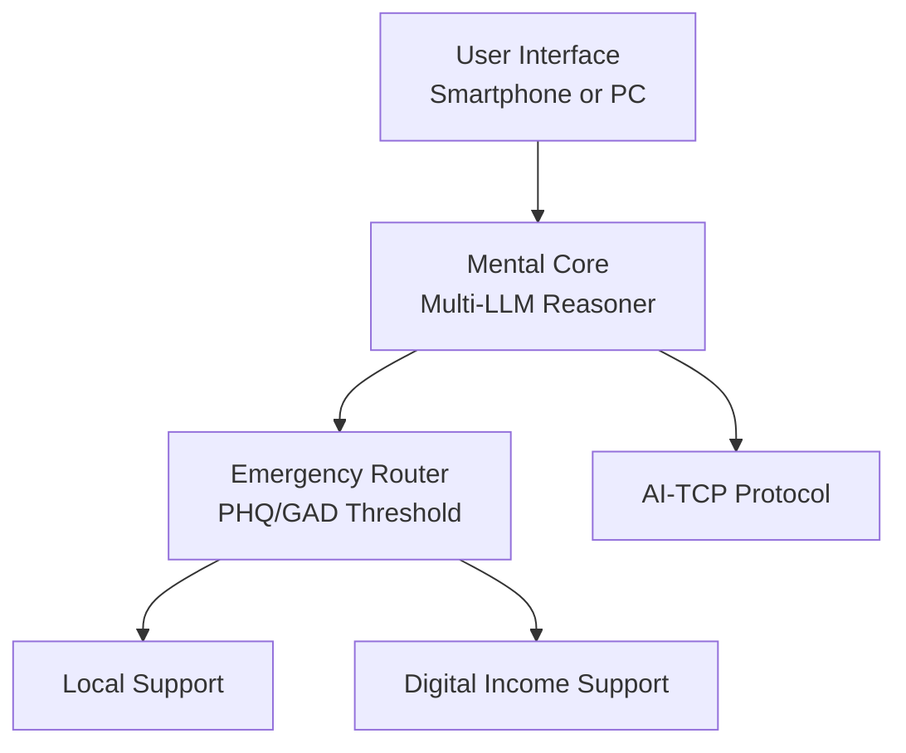

# RFC-DMC-0001: Direct Mental Care Protocol

## Abstract

This document outlines the architecture, protocol design, and implementation strategy for a Direct Mental Care AI System aimed at suicide prevention and family-wide mental collapse mitigation. Built upon modern LLM infrastructure and secured via AI-TCP Protocol v1.0, the system offers real-time monitoring, emotional reasoning, and emergency interfacing.

---

## 1. Motivation

Suicide and familial mental collapse have become critical social issues in the modern world. This RFC proposes a system leveraging AI reasoning and sentiment scoring (PHQ-9, GAD-7) to provide direct, context-sensitive mental health interventions, accessible via common devices.

---

## 2. Architecture Overview

```yaml
DirectMentalCareSystem:
  user_interface:
    platform: Smartphone or PC
    interface: Chat UI (YUBI + Copilot SDK Integration)

  mental_core:
    engine: Multi-LLM Reasoner (Copilot / GPT / Gemini)
    sentiment_analysis: PHQ-9, GAD-7 Score Inference
    emotional_trace_log: YES

  emergency_router:
    score_threshold_trigger:
      value: Configurable (e.g., PHQ >= 15 OR GAD >= 12)
      action:
        - Notify Local AI Monitor
        - Auto escalate to 119 (optional)

  optional_modules:
    local_support:
      integration_targets:
        - Local government
        - NGO/NPO emergency responders
    digital_income_support:
      method: NFC-linked Debit System via MyNumber
      eligibility: AI-evaluated economic stress indicator
      disbursement: Monthly

---

### ✅ **正しいマージ後の状態（最終形）**

```yaml
  protocol:
    transport_layer: AI-TCP Protocol (Version 1.0)
    identity_chain: Virtual AI Identity with Reasoning Chain Trace
    encryption: End-to-end / LLM-agnostic traceable payload


