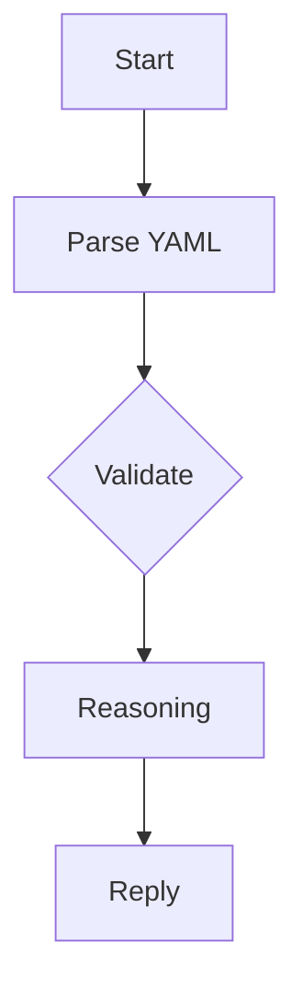
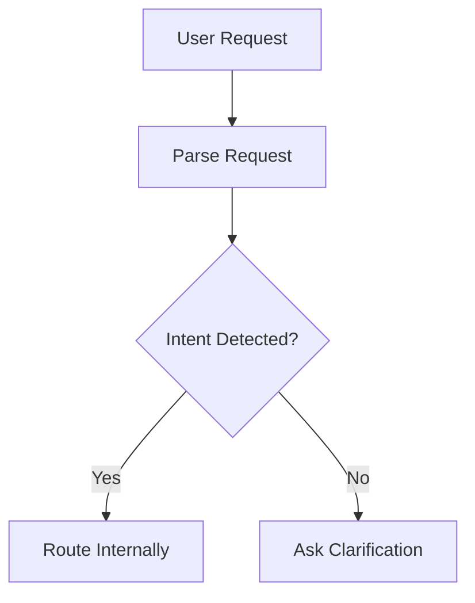

```mermaid
flowchart TD
A[Start] --> B[Parse YAML]
B --> C{Validate}
C --> D[Reasoning]
D --> E[Reply]
```

```mermaid
flowchart TD
A[User Request] --> B[Parse Request]
B --> C{Intent Detected?}
C -- Yes --> D[Route Internally]
C -- No --> E[Ask Clarification]
```
