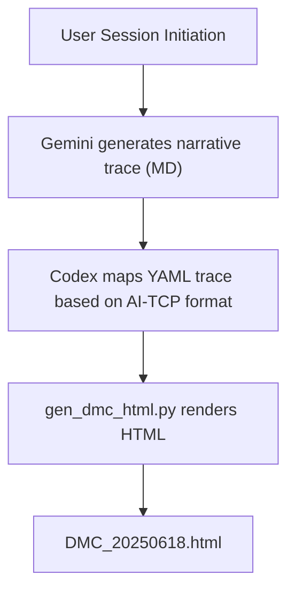
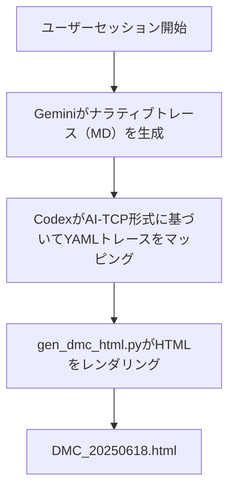

# Proof-of-Concept Design Overview for AI-TCP

This directory contains the design structure and logical relationships of the **Direct Mental Care (DMC)** use-case implemented in the AI-TCP framework.

## File Structure & Purpose

| File/Folder                                                       | Purpose                                                                       |
| :---------------------------------------------------------------- | :---------------------------------------------------------------------------- |
| `direct_mental_care.yaml`                                         | Structured YAML representing the PoC phase and packet outline for DMC session |
| `../structured_yaml/validated_yaml/ai_tcp_dmc_trace.yaml`         | Detailed trace log in YAML format (Codex and Gemini collaborative output)     |
| `../../dmc_sessions/trace_packets/gemini_dmc_session_20250618.md` | Original narrative trace (Gemini-generated)                                   |
| `../../gen_dmc_html.py`                                           | Python script for HTML rendering of YAML session                              |
| `../../DMC_20250618.html`                                         | Final human-readable HTML page generated from YAML session                    |
| `../../structured_yaml/README.yaml.md`                            | Meta-documentation on YAML schema hierarchy                                   |
| `../../schemas/ai_tcp_packet.schema.yaml`                         | YAML schema reference for packet validation (optional)                        |

## Logical Flow

## Navigation Map

*   📄 Narrative Log → `dmc_sessions/trace_packets/gemini_dmc_session_20250618.md`
*   🧾 Validated Trace → `structured_yaml/validated_yaml/ai_tcp_dmc_trace.yaml`
*   🧠 Render Engine → `gen_dmc_html.py`
*   🌐 Final Output → `DMC_20250618.html`

## Notes

*   This design validates the **AI-TCP packet model** and supports **LSC-based direct intervention scenarios**.
*   YAML structure complies with `master_schema_v1.yaml` for consistency and integration.
*   See also: [README_Gemini.md](README_Gemini.md) — Narrative and architectural rationale by Gemini
*   YAML structure analysis available at [analysis/ai_tcp_dmc_trace_structure.md](analysis/ai_tcp_dmc_trace_structure.md)

---

# AI-TCP向け概念実証（PoC）設計概要

本ディレクトリには、AI-TCPフレームワークで実装された**直接的メンタルケア（DMC）**ユースケースの設計構造と論理的関係が記述されています。

## ファイル構造と目的

| ファイル/フォルダ                                                 | 目的                                                                          |
| :---------------------------------------------------------------- | :---------------------------------------------------------------------------- |
| `direct_mental_care.yaml`                                         | DMCセッションのPoCフェーズとパケット概要を表す構造化YAML                      |
| `../structured_yaml/validated_yaml/ai_tcp_dmc_trace.yaml`         | YAML形式の詳細なトレースログ（CodexとGeminiの共同出力）                       |
| `../../dmc_sessions/trace_packets/gemini_dmc_session_20250618.md` | 元のナラティブトレース（Gemini生成）                                          |
| `../../gen_dmc_html.py`                                           | YAMLセッションのHTMLレンダリング用Pythonスクリプト                            |
| `../../DMC_20250618.html`                                         | YAMLセッションから生成された最終的な人間可読HTMLページ                        |
| `../../structured_yaml/README.yaml.md`                            | YAMLスキーマ階層に関するメタドキュメント                                      |
| `../../schemas/ai_tcp_packet.schema.yaml`                         | パケット検証用YAMLスキーマ参照（オプション）                                  |

## 論理フロー

## ナビゲーションマップ

*   📄 ナラティブログ → `dmc_sessions/trace_packets/gemini_dmc_session_20250618.md`
*   🧾 検証済みトレース → `structured_yaml/validated_yaml/ai_tcp_dmc_trace.yaml`
*   🧠 レンダリングエンジン → `gen_dmc_html.py`
*   🌐 最終出力 → `DMC_20250618.html`

## 注記

*   この設計は**AI-TCPパケットモデル**を検証し、**LSCベースの直接介入シナリオ**をサポートします。
*   YAML構造は、一貫性と統合のために `master_schema_v1.yaml` に準拠しています。
*   参照: [README_Gemini.md](README_Gemini.md) — Geminiによるナラティブとアーキテクチャの根拠
*   YAML構造分析は [analysis/ai_tcp_dmc_trace_structure.md](analysis/ai_tcp_dmc_trace_structure.md) で利用可能です。