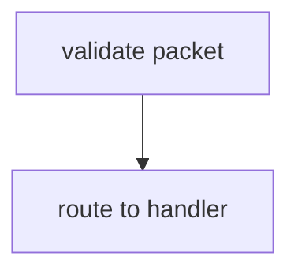

# Mermaid DSL Guidelines for AI-TCP Graph Payloads

## 1. Purpose
These guidelines standardize how `reasoning_trace` entries are converted into Mermaid graphs for the `graph_payload.graph_structure` field.

## 2. Converting `reasoning_trace` to `graph TD`
1. Number each reasoning step sequentially.
2. Create nodes with IDs `S1`, `S2`, ... matching the step order.
3. Use the `output` text as the node label.
4. Connect each node to the next using `-->`.

### Example YAML
```yaml
reasoning_trace:
  - step: 1
    input: "request received"
    output: "validate packet"
  - step: 2
    input: "validate packet"
    output: "route to handler"
```

### Converted Mermaid


## 3. Formatting Rules
- Use `<br>` for line breaks instead of `\n`.
- Do **not** include blank lines inside code blocks.
- Keep node IDs sequential (e.g., `S1`, `S2`, `S3`).

## 4. `.mmd.md` Wrapping
Store Mermaid content in files with the `.mmd.md` extension so Obsidian can render the graph:
```markdown
![[generated_mermaid/example.mmd.md]]
```
Place these files in `generated_mermaid/` as outlined in RFC 013.

## 5. GitHub vs. Obsidian
- GitHub renders Mermaid directly in Markdown preview.
- Obsidian requires the `.mmd.md` wrapper and may fail if `\n` characters are embedded.

## 6. Rendering Failures
Mermaid blocks may fail to display if:
- The `mmd:` prefix is omitted when embedded in YAML.
- Blank lines appear inside the code block.
- Line breaks use `\n` rather than `<br>`.
Ensure these points to prevent errors during automated exports.
