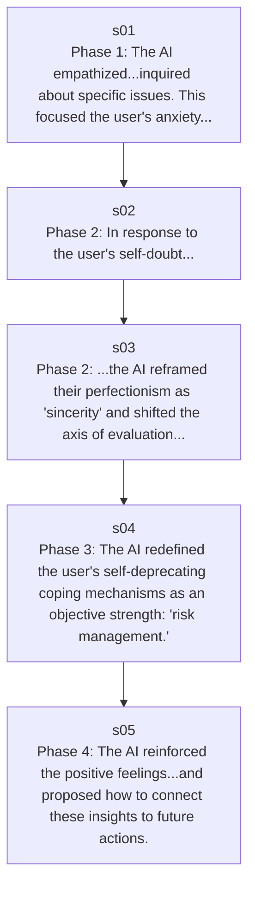

```mermaid
graph TD
    s01["s01<br>Phase 1: The AI empathized...inquired about specific issues. This focused the user's anxiety..."] --> s02
    s02["s02<br>Phase 2: In response to the user's self-doubt..."] --> s03
    s03["s03<br>Phase 2: ...the AI reframed their perfectionism as 'sincerity' and shifted the axis of evaluation..."] --> s04
    s04["s04<br>Phase 3: The AI redefined the user's self-deprecating coping mechanisms as an objective strength: 'risk management.'"] --> s05
    s05["s05<br>Phase 4: The AI reinforced the positive feelings...and proposed how to connect these insights to future actions."]
```
