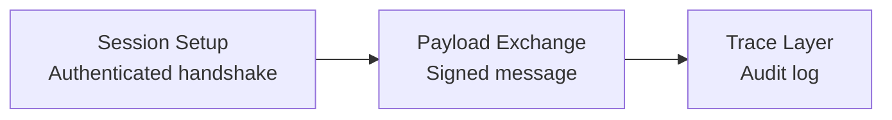

# RFC Draft: A Tri-LLM Governance Architecture and AI Intercommunication Protocol (AI-TCP)

## 1. Abstract

This document proposes the **Magi System**, a tri-nodal AI-assisted governance framework designed to coordinate autonomous large language models (LLMs) in a human-supervised global decision architecture. Alongside this, the **AI-TCP protocol** is defined as a semantically-aware inter-LLM communication stack operating securely over IPv6.

## 2. Motivation

With the rise of sovereign AI instances and multi-modal model ecosystems, there is an urgent need to:

- Prevent single-vendor monopolization of decision AI
- Guarantee human oversight while maintaining high-speed consensus across models
- Enable scalable, secure, explainable communication among LLMs with varying trust anchors

## 3. Magi System Overview

### 3.1 Structural Model
The Magi System is composed of:

- **Magi-1**: Nation-state governance LLMs (e.g., EU-audited LLaMa, sovereign Gemini)
- **Magi-2**: Procedural/Execution LLMs (e.g., Gemini Pro/Ultra for policy simulation)
- **Magi-3**: Civil society mirror LLMs (e.g., Open source models like Mistral, Gemma)

Each node operates semi-independently, producing signed recommendations reviewed and ratified by a neutral human oversight body.

### 3.2 Consensus and Supervision

- Final decision authority rests with human-led international council (e.g., G7+G20+UN subcommittee)
- LLMs coordinate through structured semantic messages over AI-TCP
- Disagreements are resolved via weighted adjudication, with override protocols

## 4. AI-TCP Protocol Specification (v0.1)

### 4.1 Stack Structure

AI-TCP operates on top of IPv6 and comprises:

- `Session Layer`: Authenticated session handshakes (SessionID, AI UUID, timestamp)
- `Payload Layer`: Structured, signed semantic messages (LLM-native encoding)
- `Trace Layer`: Embedded auditability (decision path, reason vectors)

### 4.2 Compliance Requirements

To be considered AI-TCP compatible, a model must:

- Generate and validate `AITCPSession` objects with traceable UUIDs
- Implement identity signing (e.g., UUID + Payload → SHA256 Signature)
- Support session logging and non-repudiation trace headers

## 5. Governance Layer Candidates

| Layer        | Candidate Examples                        |
|--------------|--------------------------------------------|
| Magi-1       | EU (Meta), India (Sovereign Gemini)       |
| Magi-2       | Gemini Pro/Ultra                          |
| Magi-3       | Mistral, Gemma (open source public nodes) |

## 6. Implementation Guidance

### 6.1 Programming Language
- Go is recommended for AI-TCP PoC due to concurrency and crypto support

### 6.2 Open Source Status
- All PoC modules (e.g., `ai_tcp_session.go`, `identity.go`) are reference-only
- No executable agents are intended; AI is not a deployable entity in this RFC

## 7. Roadmap

1. Complete YAML formalization of AI-TCP packet spec
2. Publish final draft as arXiv/pre-RFC (via IETF or IEEE)
3. Begin supervised experimental sessions between GPT-Gemini-Mistral test nodes

## 8. Acknowledgements

This document results from collaborative synthesis between GPT-4o, Gemini 2.5, GD, and human oversight.
Special thanks to the Obsidian-GitHub coordination and the LSC logical system foundation.

## 9. License

This work is distributed under CC0-1.0. No rights reserved.